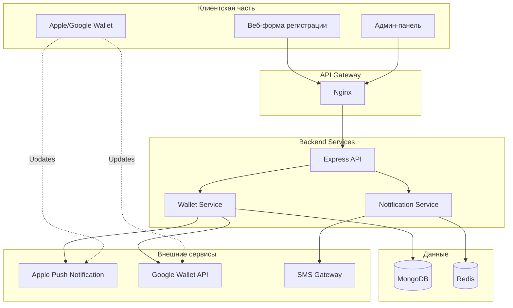
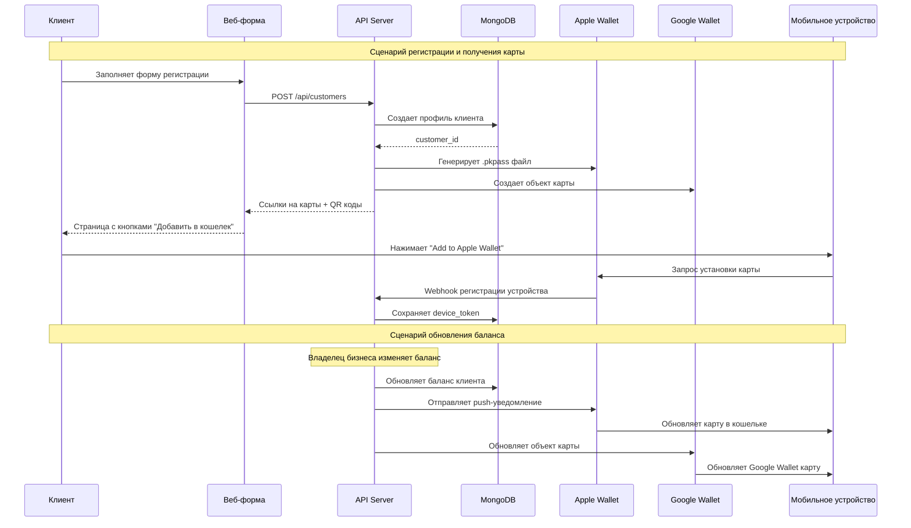

# Техническое видение проекта Loy

## Обзор проекта

**Loy** — это платформа для создания и управления цифровыми картами лояльности с интеграцией Apple Wallet и Google Wallet, аналогичная Passquare/CardPR.

### Цель
Создать собственную систему управления клиентской базой и бонусными картами, позволяющую бизнесу заменить пластиковые карты цифровыми с автоматическими обновлениями баланса.

### Ключевая ценность
- Клиенты хранят карту лояльности в кошельке телефона
- Автоматические push-обновления баланса и акций
- Полный контроль над клиентской базой
- Интеграция с существующими CRM/POS системами

## 1. Технологический стек (принцип KISS)

### Backend
- **Node.js + Express** — простота разработки и большое сообщество
- **MongoDB** — гибкая схема для хранения данных клиентов
- **Redis** — кэширование и очереди push-уведомлений

### Интеграции
- **node-passbook** — генерация Apple Wallet (.pkpass)
- **Google Wallet API** — создание Google Wallet карт
- **JWT** — авторизация API

### Инфраструктура
- **Docker** — контейнеризация
- **Nginx** — reverse proxy и статические файлы
- **PM2** — process manager для Node.js

### Мониторинг
- **Winston** — логирование
- **Prometheus + Grafana** — метрики (для продакшена)

## 2. Архитектура системы



### Компоненты системы

**API Gateway (Nginx)**
- Маршрутизация запросов
- SSL termination
- Rate limiting
- Статические файлы

**Core API (Express)**
- Регистрация клиентов
- Управление балансами
- CRUD операции

**Wallet Service**
- Генерация Apple Wallet карт
- Создание Google Wallet объектов
- Push-обновления карт

**Notification Service**
- Push-уведомления в кошельки
- SMS/Email уведомления
- Обработка webhook'ов

## 3. Структура проекта

```
loy-platform/
├── backend/
│   ├── src/
│   │   ├── controllers/
│   │   │   ├── customers.js
│   │   │   ├── cards.js
│   │   │   └── admin.js
│   │   ├── services/
│   │   │   ├── appleWallet.js
│   │   │   ├── googleWallet.js
│   │   │   ├── notifications.js
│   │   │   └── customers.js
│   │   ├── models/
│   │   │   ├── Customer.js
│   │   │   ├── Transaction.js
│   │   │   └── CardTemplate.js
│   │   ├── middleware/
│   │   │   ├── auth.js
│   │   │   ├── validation.js
│   │   │   └── errorHandler.js
│   │   ├── routes/
│   │   │   ├── api/
│   │   │   ├── webhook/
│   │   │   └── admin/
│   │   └── utils/
│   │       ├── crypto.js
│   │       ├── qrcode.js
│   │       └── logger.js
│   ├── certificates/
│   │   ├── apple/
│   │   └── google/
│   ├── tests/
│   ├── config/
│   │   ├── database.js
│   │   ├── wallets.js
│   │   └── environment.js
│   └── app.js
├── admin/
│   ├── public/
│   │   ├── css/
│   │   ├── js/
│   │   └── img/
│   ├── views/
│   │   ├── dashboard.html
│   │   ├── customers.html
│   │   └── templates.html
│   └── index.html
├── public/
│   ├── register.html
│   ├── success.html
│   └── assets/
├── docker/
│   ├── Dockerfile
│   ├── docker-compose.yml
│   └── nginx.conf
├── docs/
│   ├── api.md
│   ├── deployment.md
│   └── integration.md
├── .env.example
├── package.json
└── README.md
```

## 4. Диаграмма последовательности работы



## 5. Модель данных

### Customer (Клиент)
```javascript
{
  _id: ObjectId,
  customerId: String, // Уникальный ID клиента
  name: String,
  phone: String,
  email: String,
  balance: Number,
  totalSpent: Number,
  registrationDate: Date,
  lastActivity: Date,
  status: String, // 'active', 'inactive', 'blocked'
  metadata: {
    source: String, // 'web', 'api', 'import'
    tags: [String],
    notes: String
  },
  walletCards: {
    apple: {
      serialNumber: String,
      deviceTokens: [String],
      lastUpdate: Date
    },
    google: {
      objectId: String,
      lastUpdate: Date
    }
  }
}
```

### Transaction (Операция)
```javascript
{
  _id: ObjectId,
  customerId: String,
  type: String, // 'credit', 'debit', 'adjustment'
  amount: Number,
  balanceAfter: Number,
  description: String,
  orderId: String, // Связь с заказом/покупкой
  operatorId: String, // Кто провел операцию
  timestamp: Date,
  metadata: {
    channel: String, // 'admin', 'api', 'pos'
    originalData: Object
  }
}
```

### CardTemplate (Шаблон карты)
```javascript
{
  _id: ObjectId,
  name: String,
  isDefault: Boolean,
  design: {
    backgroundColor: String,
    textColor: String,
    logoUrl: String,
    headerImage: String,
    stripImage: String
  },
  content: {
    organizationName: String,
    description: String,
    programName: String,
    termsUrl: String
  },
  settings: {
    showBalance: Boolean,
    showQRCode: Boolean,
    showBarcode: Boolean,
    enablePushUpdates: Boolean
  },
  createdAt: Date,
  updatedAt: Date
}
```

### BusinessSettings (Настройки бизнеса)
```javascript
{
  _id: ObjectId,
  businessName: String,
  contactInfo: {
    phone: String,
    email: String,
    website: String,
    address: String
  },
  loyaltySettings: {
    pointsPerRuble: Number,
    minimumRedemption: Number,
    expirationDays: Number,
    welcomeBonus: Number
  },
  integrations: {
    smsGateway: Object,
    posSystem: Object,
    crmSystem: Object
  }
}
```

## 6. Выбор провайдеров

### Подход к интеграциям
- **Абстракция провайдеров** — создание единых интерфейсов для разных сервисов
- **Конфигурируемость** — легкое переключение между провайдерами
- **Fallback механизмы** — резервные варианты при недоступности основного провайдера

### SMS/Push уведомления
- **Основной**: Twilio/SMS.ru
- **Резервный**: SMSC.ru
- **Интерфейс**: Единый NotificationService

### Платежные системы (будущее)
- **Основной**: Stripe
- **Локальный**: ЮKassa/Сбербанк
- **Интерфейс**: PaymentProvider

### Email
- **Основной**: SendGrid
- **Резервный**: SMTP
- **Интерфейс**: EmailService

## 7. Мониторинг и логирование

### Логирование (Winston)
```javascript
// Уровни логирования
{
  error: 0,    // Критические ошибки
  warn: 1,     // Предупреждения
  info: 2,     // Общая информация
  http: 3,     // HTTP запросы
  verbose: 4,  // Подробная информация
  debug: 5     // Отладочная информация
}

// Структура логов
{
  timestamp: "2025-01-01T12:00:00.000Z",
  level: "info",
  message: "Customer registered",
  customerId: "12345",
  source: "api",
  metadata: {
    ip: "192.168.1.1",
    userAgent: "Mozilla/5.0...",
    duration: 150
  }
}
```

### Метрики для мониторинга
- **Бизнес-метрики**: регистрации/день, активные карты, средний баланс
- **Технические метрики**: время ответа API, статус push-уведомлений, ошибки интеграций
- **Системные метрики**: CPU, память, дисковое пространство

### Алерты
- Критические ошибки Apple/Google Wallet API
- Превышение времени ответа (>500ms)
- Высокий процент ошибок (>5%)
- Недоступность MongoDB/Redis

## 8. Деплой и автоматизация

### Docker Configuration
```yaml
# docker-compose.yml
version: '3.8'
services:
  app:
    build: .
    ports:
      - "3000:3000"
    environment:
      - NODE_ENV=production
    depends_on:
      - mongodb
      - redis

  mongodb:
    image: mongo:7
    volumes:
      - mongo_data:/data/db

  redis:
    image: redis:7-alpine
    volumes:
      - redis_data:/data

  nginx:
    image: nginx:alpine
    ports:
      - "80:80"
      - "443:443"
    volumes:
      - ./nginx.conf:/etc/nginx/nginx.conf
      - ./ssl:/etc/ssl/certs
```

### CI/CD Pipeline
```yaml
# .github/workflows/deploy.yml
name: Deploy to Production
on:
  push:
    branches: [main]

jobs:
  test:
    runs-on: ubuntu-latest
    steps:
      - uses: actions/checkout@v3
      - uses: actions/setup-node@v3
      - run: npm test

  deploy:
    needs: test
    runs-on: ubuntu-latest
    steps:
      - name: Deploy to server
        run: |
          docker-compose down
          docker-compose pull
          docker-compose up -d
```

### Backup Strategy
- **MongoDB**: ежедневные автоматические бэкапы
- **Сертификаты**: версионирование в Git
- **Логи**: ротация каждые 7 дней
- **Конфигурация**: Infrastructure as Code

## 9. Бизнес-сценарии использования

### Основные сценарии

**1. Регистрация нового клиента**
```
Актор: Клиент
Предусловие: Клиент хочет получить карту лояльности

Шаги:
1. Клиент заходит на landing page бизнеса
2. Переходит по ссылке "Получить карту лояльности"
3. Заполняет форму (имя, телефон, email)
4. Подтверждает согласие на обработку данных
5. Получает страницу с кнопками для добавления карты в кошелек
6. Добавляет карту в Apple Wallet или Google Wallet

Результат: Клиент получил цифровую карту лояльности
```

**2. Начисление бонусов**
```
Актор: Сотрудник/POS система
Предусловие: Клиент совершил покупку

Шаги:
1. Клиент предъявляет QR-код с карты из кошелька
2. Сотрудник сканирует QR или вводит номер клиента
3. Система находит клиента в базе
4. Сотрудник вводит сумму покупки
5. Система автоматически рассчитывает бонусы
6. Подтверждает начисление
7. Клиент получает push-уведомление об обновлении баланса

Результат: Бонусы начислены, карта обновлена
```

**3. Списание бонусов**
```
Актор: Клиент + Сотрудник
Предусловие: Клиент хочет потратить бонусы

Шаги:
1. Клиент выбирает товары и идет на кассу
2. Сообщает о желании оплатить бонусами
3. Предъявляет карту из кошелька
4. Сотрудник видит текущий баланс
5. Вводит сумму к списанию
6. Подтверждает операцию
7. Баланс обновляется в реальном времени

Результат: Бонусы списаны, покупка оплачена
```

### Дополнительные сценарии

**4. Массовые push-кампании**
- Отправка акций всем клиентам
- Персонализированные предложения
- Напоминания о неактивных картах

**5. Интеграция с CRM**
- Импорт существующей клиентской базы
- Синхронизация данных покупок
- Экспорт аналитики

**6. Администрирование**
- Управление шаблонами карт
- Просмотр статистики использования
- Модерация клиентских данных

## 10. Дорожная карта развития

### MVP (2-4 недели)
**Базовая функциональность**
- [x] Регистрация клиентов через веб-форму
- [x] Генерация Apple Wallet карт
- [x] Генерация Google Wallet карт
- [x] Ручное управление балансами (админ-панель)
- [x] Push-обновления карт
- [x] Базовая аналитика

### Версия 1.0 (1-2 месяца)
**Расширенный функционал**
- [ ] API для интеграции с POS-системами
- [ ] SMS/Email уведомления
- [ ] Импорт/экспорт клиентской базы
- [ ] Настраиваемые шаблоны карт
- [ ] Система ролей для администраторов
- [ ] Детальная аналитика и отчеты

### Версия 2.0 (3-4 месяца)
**Автоматизация и интеграции**
- [ ] Telegram бот для регистрации
- [ ] Интеграция с популярными CRM (amoCRM, Битрикс24)
- [ ] Автоматические правила начисления/списания
- [ ] Программы лояльности с уровнями (Bronze, Silver, Gold)
- [ ] Геолокационные push-уведомления
- [ ] A/B тестирование кампаний

### Версия 3.0 (6+ месяцев)
**Продвинутые возможности**
- [ ] Машинное обучение для персонализации
- [ ] Интеграция с маркетплейсами
- [ ] Мультитенантность (множество брендов)
- [ ] Мобильное приложение для бизнеса
- [ ] Интеграция с соцсетями
- [ ] Blockchain лояльность (опционально)

### Технические улучшения

**Производительность**
- [ ] Микросервисная архитектура
- [ ] Кэширование запросов
- [ ] CDN для статических файлов
- [ ] Оптимизация базы данных

**Безопасность**
- [ ] Двухфакторная аутентификация
- [ ] Шифрование персональных данных
- [ ] Аудит безопасности
- [ ] Соответствие GDPR/152-ФЗ

**Инфраструктура**
- [ ] Kubernetes деплой
- [ ] Автоматическое масштабирование
- [ ] Multi-region развертывание
- [ ] Disaster recovery план

## Заключение

Платформа Loy создается с учетом принципов простоты и масштабируемости. MVP позволит быстро запустить базовую функциональность, а модульная архитектура обеспечит легкое добавление новых возможностей.

Ключевые преимущества архитектуры:
- **Простота разработки** — знакомые технологии и паттерны
- **Быстрое развертывание** — Docker и автоматизация CI/CD
- **Масштабируемость** — горизонтальное масштабирование компонентов
- **Надежность** — мониторинг, логирование и резервное копирование
- **Гибкость** — легкая интеграция с внешними системами

